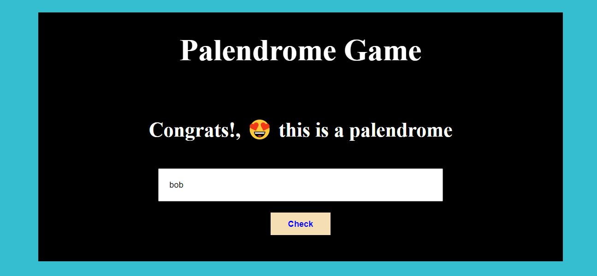

# ⭐ Project - Palendrome game App⭐

This  project of javascript is made from pure HTML,CSS and Javascript.

I got this assignment from iNeuron Bootcamp.

 

📌 Learnings:

👉 1\. How to check whether the character is palendrome or not 
👉 2\. Html and css revision  

 

> Time taken to build this project is 30 min.

  

## Links

[Link](javascriptmypalendromeapp.netlify.app)

[Linkedin](https://www.linkedin.com/in/pratyush-kesarwani-2b6601171/)

### Acknowledgements:

I am thankful to Hitesh Choudhary sir, Anurag sir and iNeuron team for this amazing bootcamp.
